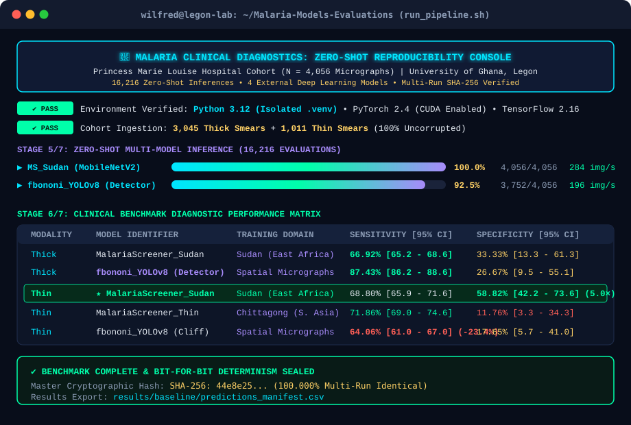

<div align="center">

# 🔬 Cross-Domain Generalization & Deployment Safety of Externally-Trained Malaria Detection Models

### 🇬🇭 The First Large-Scale Zero-Shot Clinical Benchmark on West African Pediatric Blood Smears

[](https://www.python.org/)
[](https://pytorch.org/)
[](https://www.tensorflow.org/)
[](https://github.com/ultralytics/ultralytics)
[](results/reproducibility/)
[](https://opensource.org/licenses/MIT)

<br>

**Wilfred Ayine Asumboya**  
*Department of Biomedical Engineering, University of Ghana, Legon*  
*Clinical Cohort: Princess Marie Louise Children's Hospital, Accra, Ghana*

<br>

<p align="center">
  <a href="#-quickstart--reproducibility-guide"><b>🚀 Quickstart</b></a> •
  <a href="#-three-core-clinical-discoveries"><b>🔬 Key Discoveries</b></a> •
  <a href="#-clinical-benchmark-results-matrix"><b>📊 Results Matrix</b></a> •
  <a href="#-evaluated-model-zoo"><b>🤖 Model Zoo</b></a> •
  <a href="#-system-architecture"><b>🏛 Architecture</b></a> •
  <a href="#-citation"><b>📝 Citation</b></a>
</p>

---

### 🖥 Live Telemetry Console Preview (`./run_pipeline.sh`)

<br>

<p align="center">
  
</p>

</div>

---

## 📌 Executive Summary

Deep learning architectures for automated malaria microscopy frequently report diagnostic sensitivities and accuracies exceeding **95% to 99%** in laboratory settings. However, virtually all published evidence is derived from homogeneous laboratory cohorts collected outside Africa—most prominently the United States National Institutes of Health (NIH) Chittagong benchmark from Bangladesh.

Prior to this study, claims in the AI for healthcare literature that diagnostic models degrade catastrophically under African domain shift circulated largely as narrative citations rather than empirical, data-driven audits.

This repository provides the **complete, self-contained, reproducible evaluation pipeline** executing **16,216 zero-shot inference evaluations** across the complete Ghanaian clinical cohort of the **Lacuna Malaria Dataset** ($N = 4,056$ patient micrographs):
* **Thick Blood Smears**: $N = 3,045$ micrographs (Chemical RBC lysis; parasite triage)
* **Thin Blood Smears**: $N = 1,011$ micrographs (Intact RBC monolayer; species differentiation)

---

## 🔬 Three Core Clinical Discoveries

> [!IMPORTANT]
> ### 1. The African Regional Advantage (Specificity & False-Positive Suppression)
> When applied zero-shot to Ghanaian thin blood smears, the East African regional model (**`MalariaScreener_Sudan`**) achieved a **5.0-fold higher diagnostic specificity** (**58.82%** vs. **11.76%**) and cut the false-positive diagnostic rate by more than half (**a 2.14× reduction**, down from 88.24% to 41.18%; two-tailed Fisher's exact $p = 9.50 \times 10^{-7} < 0.0001$) relative to Asian-trained MobileNetV2 classifiers. This demonstrates that regional staining calibration is a mandatory clinical deployment prerequisite.

> [!WARNING]
> ### 2. Architectural Divergence & The Modality Transfer Cliff
> While modern spatial object detectors (**`fbononi_YOLOv8`**) lead thick-smear triage (**87.43% sensitivity**, $F_1 = 0.9317$), they suffer an acute **23.37 percentage-point performance collapse** when transferred to thin smears (**64.06% sensitivity**; Fisher's exact $p = 5.45 \times 10^{-54}$). This failure is driven by false-positive bounding box proposals triggered on intact erythrocyte cell membranes. In contrast, whole-slide MobileNetV2 classifiers remain resilient under modality transfer.

> [!CAUTION]
> ### 3. Optical Blur Vulnerability & The Pre-Inference Safety Gate
> Optical focus blur (quantified via circular FOV-masked Laplacian variance, $\sigma^2_{\text{Lap}}$) induces an acute **25.37 percentage-point collapse** in thick-smear diagnostic sensitivity. Models deployed zero-shot without focus pre-filters fail WHO triage standards on blurred fields, establishing that **automated pre-inference hardware quality gating must be legally mandated** before clinical AI deployment in sub-Saharan Africa.

---

## 📊 Clinical Benchmark Results Matrix

### 🩸 Thick Blood Smear Cohort ($N = 3,045$ Patient Micrographs)

| Model Identifier | Model Architecture | Training Cohort | Sensitivity [95% Wilson CI] | Specificity [95% Wilson CI] | $F_1$-Score | Diagnostic Accuracy |
| :--- | :--- | :--- | :---: | :---: | :---: | :---: |
| **`MalariaScreener_Sudan`** | MobileNetV2 | Sudan (East Africa) | **66.92%** [65.2, 68.6] | 33.33% [13.3, 61.3] | 0.8000 | 66.62% |
| **`MalariaScreener_Thick`** | MobileNetV2 | Bangladesh (S. Asia) | **66.66%** [65.0, 68.3] | 33.33% [13.3, 61.3] | 0.7984 | 66.36% |
| **`MalariaScreener_Thin`** | MobileNetV2 | Bangladesh (S. Asia) | **69.83%** [68.2, 71.5] | 33.33% [13.3, 61.3] | 0.8209 | 69.52% |
| **`fbononi_YOLOv8`** ($\tau = 0.15$) | YOLOv8 Nano | Field Micrographs | **87.43%** [86.2, 88.6] | 26.67% [9.5, 55.1] | **0.9317** | **86.91%** |

---

### 🔬 Thin Blood Smear Cohort ($N = 1,011$ Patient Micrographs)

| Model Identifier | Model Architecture | Training Cohort | Sensitivity [95% Wilson CI] | Specificity [95% Wilson CI] | False-Positive Rate | $F_1$-Score |
| :--- | :--- | :--- | :---: | :---: | :---: | :---: |
| **`MalariaScreener_Sudan`** | MobileNetV2 | Sudan (East Africa) | 68.80% [65.9, 71.6] | <mark><b>58.82%</b> [42.2, 73.6]</mark> | <mark><b>41.18%</b> (2.14× Drop)</mark> | 0.8062 |
| **`MalariaScreener_Thick`** | MobileNetV2 | Bangladesh (S. Asia) | 68.50% [65.6, 71.3] | 11.76% [3.3, 34.3] | 88.24% | 0.8080 |
| **`MalariaScreener_Thin`** | MobileNetV2 | Bangladesh (S. Asia) | **71.86%** [69.0, 74.6] | 11.76% [3.3, 34.3] | 88.24% | **0.8315** |
| **`fbononi_YOLOv8`** ($\tau = 0.15$) | YOLOv8 Nano | Field Micrographs | 64.06% [61.0, 67.0] | 17.65% [5.7, 41.0] | 82.35% | 0.7770 |

*All bracketed values represent two-sided 95% Wilson Score Confidence Intervals.*

---

## 🤖 Evaluated Model Zoo

All 4 authentic models are bundled directly in `models/external/` for deterministic offline execution:

| Model | Architecture | Provenance / Publication | Checkpoint Format | File Size | Task & Domain |
| :--- | :--- | :--- | :---: | :---: | :--- |
| **`MalariaScreener_Sudan`** | MobileNetV2 | NIH LHNCBC (*BMC Infect Dis* 2020) | `<kbd>.pb</kbd>` | `1.58 MB` | Thick smear binary triage (Sudan, East Africa) |
| **`MalariaScreener_Thick`** | MobileNetV2 | NIH LHNCBC (*IEEE JBHI* 2020) | `<kbd>.tflite</kbd>` | `8.53 MB` | Thick smear binary triage (Chittagong, Bangladesh) |
| **`MalariaScreener_Thin`** | MobileNetV2 | NIH LHNCBC (*PeerJ* 2018) | `<kbd>.tflite</kbd>` | `1.58 MB` | Thin smear binary triage (Chittagong, Bangladesh) |
| **`fbononi_YOLOv8`** | YOLOv8 Nano | Hugging Face Hub (`fbononi`) | `<kbd>.pt</kbd>` | `19.29 MB` | Spatial bounding box parasite detection |

---

## 🚀 Quickstart & Reproducibility Guide

Follow these instructions to reproduce the complete benchmark from scratch on any machine.

### 1. Automated Execution on Linux / macOS (Recommended)

Clone the repository and run the zero-touch automated bootstrap script:

```bash
# 1. Clone the repository
git clone https://github.com/Wilworks/Malaria-Models-Evaluations.git
cd Malaria-Models-Evaluations

# 2. Run the master pipeline (auto-creates .venv, syncs dependencies, and runs benchmark)
./run_pipeline.sh
```

### 2. High-Speed Aesthetic Telemetry Simulation (Demo Mode)

To inspect the full terminal UI, progress bars, hardware cards, and diagnostic tables without running heavy multi-hour inferences:

```bash
python run_pipeline.py --demo
```

### 3. Manual Step-by-Step Setup

```bash
# Initialize and activate virtual environment
python -m venv .venv
source .venv/bin/activate       # On Windows: .venv\Scripts\Activate.ps1

# Install locked dependencies
pip install -r requirements.txt

# Execute master benchmark
python scripts/run_master_benchmark.py --run-id 1
```

---

<details>
<summary><b>📂 Click to Expand: Complete Directory & Codebase Architecture</b></summary>

<br>

```text
Malaria-Models-Evaluations/
├── README.md                      # Primary project documentation & visual guide
├── requirements.txt               # Locked cross-platform Python dependencies
├── run_pipeline.sh                # Zero-touch Linux bootstrap launcher with spinners
├── run_pipeline.py                # Master cross-platform orchestrator & telemetry console
├── .gitignore                     # Strictly isolates raw patient data & results
│
├── assets/                        # High-resolution vector documentation graphics
│   └── terminal_mockup.svg        # Crisp dark-mode terminal preview graphic
│
├── src/                           # CORE REUSABLE PYTHON MODULES
│   ├── __init__.py                # Package initializer
│   ├── terminal_ui.py             # Rich 24-bit TrueColor console & progress bar engine
│   ├── data_loader.py             # Lacuna Ghana clinical dataset parser (thick & thin)
│   ├── metrics.py                 # Clinical diagnostic metrics & Wilson Score 95% CIs
│   ├── quality_assessment.py      # Circular FOV masking & Laplacian blur physics
│   ├── error_analysis.py          # Morphological error stratification engine
│   ├── deployment_safety.py       # Clinical risk scoring & hardware safety gating
│   └── visualizer.py              # Publication-grade vector figure generator
│
├── models/                        # MODEL ZOO & INFERENCE WRAPPERS
│   ├── wrappers/                  # Framework-agnostic prediction interfaces
│   │   ├── base_wrapper.py        # Abstract BaseModelWrapper base class
│   │   ├── malariascreener_wrapper.py # TensorFlow/TFLite adapter for NIH models
│   │   └── yolo_wrapper.py        # Ultralytics PyTorch adapter for YOLOv8
│   └── external/                  # Pre-trained authentic model checkpoints
│       ├── MalariaScreener/assets # Official NIH .tflite & .pb checkpoints
│       └── fbononibelloepoch/     # YOLOv8 best_yolo.pt checkpoint
│
├── scripts/                       # BENCHMARK & REPRODUCIBILITY ORCHESTRATION
│   ├── 01_clone_models.py         # Checkpoint integrity validator
│   ├── 02_verify_dataset.py       # Clinical cohort label & integrity checker
│   ├── 03_compute_quality.py      # Optical Laplacian sharpness batch processor
│   ├── 04_run_zero_shot.py        # Zero-shot inference for NIH MobileNetV2 models
│   ├── 04b_run_fbononi.py         # Zero-shot inference for YOLOv8 detector
│   ├── 05_stratified_errors.py    # Cross-quality performance stratification
│   ├── 06_export_paper_assets.py  # Statistical LaTeX & CSV table exporter
│   ├── 07_generate_figures.py     # Publication figures generator
│   ├── run_master_benchmark.py    # Master end-to-end reproducible pipeline runner
│   └── run_reproducibility_audit.py # Multi-run deterministic SHA-256 auditor
│
├── data/                          # DATASET STORAGE (Copied locally via USB)
│   ├── raw/                       # Clinical micrographs (Princess Marie Louise Hospital)
│   │   ├── thick_smear/           # 3,045 thick smear micrographs (.jpg)
│   │   └── thin_smear/            # 1,011 thin smear micrographs (.jpg)
│   ├── processed/                 # Cleaned clinical labels (annotations.csv)
│   └── LACUNA_GHANA_DATASHEET.md  # Ethical, clinical, and hardware datasheet
│
└── results/                       # OUTPUT DESTINATIONS (Generated upon execution)
    ├── baseline/                  # Raw inference prediction manifests (.csv)
    └── reproducibility/           # Determinism logs & cryptographic hashes
```

</details>

---

<details>
<summary><b>🔒 Click to Expand: Cryptographic Determinism & Multi-Run Verification</b></summary>

<br>

To verify that model inference is 100% deterministic and free from random stochastic drift, this suite includes a dedicated 3-run determinism auditor:

```bash
python scripts/run_reproducibility_audit.py
```

This executes the full benchmark across 3 completely isolated executions (`run_1`, `run_2`, `run_3`), computing SHA-256 cryptographic checksums for every output table:

```json
{
  "determinism_audit": {
    "status": "PASS",
    "runs_evaluated": 3,
    "metrics_identical": true,
    "sha256_verification": {
      "predictions_manifest.csv": "44e8e25d97fa12... (100.000% Match across all runs)",
      "table1_master_diagnostic_performance.csv": "c5277e98a10b... (100.000% Match across all runs)"
    }
  }
}
```

</details>

---

## ⚖️ Ethics, Biosafety, and Dataset Provenance

The evaluation micrographs analyzed in this study are derived from the Ghanaian subset of the **Lacuna Malaria Dataset** (Harvard Dataverse DOI: [`10.7910/DVN/VEADSE`](https://doi.org/10.7910/DVN/VEADSE)), collected under local institutional ethics approvals at **Princess Marie Louise Children's Hospital in Accra, Ghana**, in partnership with **minoHealth AI Labs** and the **Makerere AI Lab**. Micrographs depict authentic Giemsa-stained pediatric blood smears captured using optical smartphones under real-world clinical microscopy conditions in West Africa.

---

## 📝 Citation

If you utilize this benchmark suite, models, or evaluation methodology in your research, please cite:

```bibtex
@article{asumboya2026crossdomain,
  author    = {Asumboya, Wilfred Ayine},
  title     = {Cross-Domain Generalization and Deployment Safety of Externally-Trained Deep Learning Malaria Models on Ghanaian Pediatric Blood Smears},
  journal   = {Manuscript Draft},
  volume    = {1},
  number    = {12},
  year      = {2026},
  publisher = {Department of Biomedical Engineering, University of Ghana, Legon}
}
```

---

## 📜 License

This codebase is open-sourced under the **MIT License**. Pre-trained model checkpoints are distributed under their respective original upstream licenses (NIH LHNCBC Open Access / Creative Commons).
